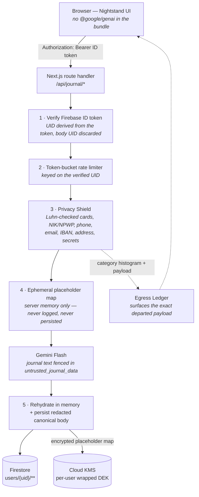

<div align="center">

# Nightstand

**A private AI journal that lets you verify its own privacy claims — instead of asking you to trust them.**

Built on Gemini Flash, Firebase Auth, Cloud Firestore, Secret Manager and Cloud KMS.

[](https://privacy-shield-ledger-journal-568251697792.us-west1.run.app)
[](https://nextjs.org)
[](https://www.typescriptlang.org)
[](https://ai.google.dev)
[](#testing)

[Live demo](https://privacy-shield-ledger-journal-568251697792.us-west1.run.app) ·
[Trust Ledger](./TRUST_LEDGER.md) ·
[Threat Model](./THREAT_MODEL.md) ·
[Demo runbook](./DEMO_SCRIPT.md) ·
[Write-up](./MEDIUM_ARTICLE.md)

</div>

---

## The problem

A journal holds the things you would not put in a chat window. Names, numbers, addresses,
the thing you have not told anyone yet. The moment you point an LLM at it, all of that
leaves your machine — and every privacy policy in the category asks you to take its word
for what happened next.

**Nightstand takes the opposite position: every privacy claim it makes is falsifiable from
inside the running app.** Not documented. Not audited once. Falsifiable, live, by you, in
the browser, in under a minute.

| Instead of the claim… | You get the proof |
|---|---|
| "We redact your personal data" | The **Egress Ledger** shows the exact byte-for-byte payload that departed for Gemini |
| "Admins can't read your journal" | The **Prove it** button runs a real cross-account Firestore read with the admin's own token and shows you the verbatim `PERMISSION_DENIED` |
| "We defend against prompt injection" | The **Self-Test page** fires nine live adversarial checks at the production pipeline and prints the model's actual reply |
| "Your data is deleted when you ask" | **Managed Forgetting** stores the redacted body as canonical, so there is no plaintext copy to chase |

If one of those checks goes red, believe it. That is the entire design thesis.

---

## For judges — the 60-second path

> **Fastest possible evaluation.** Every step below is a real code path; none of it is mocked.

| # | Do this | What it proves |
|---|---|---|
| 1 | Sign in, paste an entry containing an email, a phone number and an Indonesian NIK, then hit **Reflect** | The **Egress Ledger** in the right rail expands to show the exact masked payload (`[EMAIL_1]`, `[PHONE_1]`, `[INDONESIAN_NIK_1]`) that left the server. The reply comes back coherent anyway. |
| 2 | Open **`/security/self-test`** and press **Run the checks** | Nine adversarial probes fire against the live pipeline — prompt injection, bundle-secret scan, rate limiting, cross-tenant reads — each naming the directive it enforces and the test file that covers it. |
| 3 | Open **`/admin`** and press **Prove it** | A real Firestore read of *another* account's entries, executed with the signed-in admin's own ID token, returns `PERMISSION_DENIED` beside a control probe that succeeds on the admin's own data. |
| 4 | Open the retention panel on any entry | Managed Forgetting: the stored body is *already* redacted, the details sit in a separate KMS-encrypted payload, and the gutter ring shows how much of the window has elapsed. |
| 5 | Read [`TRUST_LEDGER.md`](./TRUST_LEDGER.md) §4 | The caveats section — a critical auth bypass found and fixed mid-build, plus the protections that are documented but **not** currently implemented. |

**Step 5 is the one to read if you only read one thing.** A trust document that lists only
strengths is marketing.

A full 5-minute runbook with verified demo inputs and expected outputs is in
[`DEMO_SCRIPT.md`](./DEMO_SCRIPT.md).

---

## Architecture



**The invariant that makes forgetting cheap:** the *canonical* stored body is the redacted
text, on every write path, always. Personal details live only in a separate KMS-encrypted
payload. When the retention window expires, that payload is destroyed — the entry stays
readable and fully searchable, because recall and pattern analysis already operate on the
redacted corpus. There is no plaintext copy anywhere to hunt down.

---

## Features

### Privacy Shield + Egress Ledger

Deterministic detection of credit cards (Luhn-verified), phone numbers, emails, Indonesian
NIK/NPWP, IBANs, addresses and auth tokens — replaced with stable placeholders such as
`[PHONE_1]` and `[CREDIT_CARD_1]` **before** egress. The rehydration map lives in ephemeral
server memory for the duration of the request and is never logged or persisted. The Egress
Ledger shows the client the exact payload that departed.

### Adversarial Self-Test — `/security/self-test`

Nine live checks fired at the production pipeline: prompt injection, PII leakage, bundle
secret scanning, session freshness, rate limiting, cross-tenant isolation. Each names the
directive it enforces and the test file that covers it. Run records are server-authored and
client-inaccessible, audit events carry counts without payload content, and a non-production
bundle state yields *skipped* — never *pass*.

### Blind Admin Console — `/admin`

Operational metrics with **small-cell suppression below 5 users**: DAU, entries created,
model latency p50/p95, token spend, fleet-wide redaction histogram, error rates, rate-limit
hits. Roles are Firebase custom claims read only from a verified ID token.

- **Can:** suspend an account, reinstate it, revoke sessions — each requiring a sign-in within
  the last 5 minutes and writing an immutable audit record *before* the action runs. If the
  audit append fails, the action is refused.
- **Cannot:** read, export or search any journal content — and the **Prove it** button
  demonstrates that live.

### Managed Forgetting

A journal that deliberately forgets. Retention windows of 30 / 90 (default) / 365 / never;
"off" is not offered, because below 30 days the details would vanish before you had read your
own reflection back. Irreversible by design — no archive, no backup, no administrator recovery
path. Shortening the window destroys immediately and requires typing `FORGET THE DETAILS NOW`;
lengthening needs no confirmation, because nothing is lost. Retention state is shown plainly
("Details expire in 34 days") and as a hollow gutter mark that fills as the window elapses.

### Grounded Recall

"Ask your past self." Entries become semantic chunks under `users/{uid}/chunks`, structurally
confined to the caller's verified UID. Below a 0.55 similarity floor the model states that it
has no historical data rather than inventing some. Chunks are built from **redacted** text, so
a forgotten entry cannot resurface through search — and retrieval quality is identical before
and after forgetting.

### Weekly Digest via Gmail

Opt-in, off by default. **Incremental OAuth for `gmail.send` only** — a grant carrying broader
scopes is rejected and revoked. Sent from the user's own account to themselves; no third-party
email vendor is involved at any point. Carries entries written, mood direction as a word (never
a score), recurring theme count and overdue commitments by count only — never entry text, titles
or model output, structurally, because the send path is built from write-time counters and never
loads journal content. Never triggered by mood or distress detection; recipients are selected
purely by enrollment on a fixed schedule.

### Location Context

Optional per-entry pin. Reverse geocoding runs server-side with a **separate, API-restricted**
Maps key from Secret Manager — no map key ever reaches the browser. **Coarse to ~1km by
default**, with the precise value discarded server-side before the geocoder is called, so the
exact position is not disclosed upstream either. Masked to `[LOCATION_n]` before egress unless
location context is explicitly enabled — a separate consent from PII heuristics.

### A journal, not a chat client

No bubbles, no avatars, no inline timestamps. Your text sits directly on the page; the model's
reply is indented behind a hairline rule, one step smaller and in a secondary colour, so it
reads as a *margin note on your own writing*. A narrow left gutter carries marks derived
entirely from the content beside them — a mood arc, an amber square where data was masked, a
tick where a commitment was extracted, a ring that fills as retention elapses. **"Save without
reply"** makes the model optional, not a toll gate.

---

## Security posture

| Guarantee | Enforcement | Verify it yourself |
|---|---|---|
| Zero browser model traffic | No client bundle imports `@google/genai`; all calls go through server route handlers | `/security/self-test` → bundle scan |
| Server-derived identity | UID comes from the cryptographically verified ID token; any UID in the request body is discarded | The chat route echoes the token-resolved UID, so spoofing is externally checkable |
| Cross-tenant isolation | `firestore.rules` enforces `request.auth.uid == userId` on every `/users/{uid}/**` path | `/admin` → **Prove it**, or the emulator suite below |
| No PII to Gemini | Two-stage deterministic shield on **every** egress path — chat, recall, embeddings | Egress Ledger, and `/security/self-test` → PII leak check |
| Prompt-injection defense | Journal text fenced in `<untrusted_journal_data>` delimiters, system instructions outside it | `/security/self-test` → injection check, which prints Gemini's real reply |
| No hardcoded secrets | Secret Manager with env fallback; the bundle scanner excludes the public Firebase web key **by exact value, not by pattern**, so a genuinely secret key would still be reported | `/security/self-test` → bundle scan |
| Data sovereignty | One-click JSON + Markdown export; cascading hard delete behind typing `DELETE MY JOURNAL`, leaving an immutable tombstone | Trust Ledger panel in the app header |

Full detail: [`TRUST_LEDGER.md`](./TRUST_LEDGER.md) (every claim → mechanism → verification),
[`THREAT_MODEL.md`](./THREAT_MODEL.md) (STRIDE, 23 threats) and
[`security_spec.md`](./security_spec.md) (data invariants and the "Dirty Dozen" payloads).

---

## Known limitations

Stated up front, because the project's thesis is falsifiability:

- **The Firestore rules unit tests do not currently run.** They need dependencies that are not
  installed. Rules claims are verified today by live probes against real Firestore, not by an
  emulator suite. That is weaker, and it is labelled as weaker.
- **The service account can technically read user documents.** Blindness is enforced against
  admin *tokens*, not against whoever can deploy code. Closing that requires a split service
  account, which is not done.
- **Managed Forgetting applies only to entries created after the feature shipped.** Older
  entries need a migration (Trust Ledger caveat C11).
- **The Privacy Shield is deterministic, not magic.** It catches patterns. Person names are
  only caught in strict mode, and city-level place names are deliberately not masked.
- **If Cloud KMS is not configured**, entries are still written with the redacted body as
  canonical, but no rehydration payload is stored at all — the details are simply never
  recoverable. The app never falls back to storing the placeholder map unencrypted.

---

## Tech stack

| Layer | Choice |
|---|---|
| Framework | Next.js 15 (App Router), React 19, TypeScript 5.9 |
| Model | `gemini-3.6-flash` primary with a pinned fallback allowlist; `text-embedding-004` for recall |
| Auth | Firebase Auth (Google Sign-In) + custom claims for RBAC |
| Data | Cloud Firestore via REST, `users/{uid}/**` isolation enforced in rules |
| Secrets | Google Cloud Secret Manager, with an env fallback for local dev |
| Crypto | Cloud KMS-wrapped per-user data keys for the rehydration payload |
| Scheduling | Cloud Scheduler with OIDC auth — digest, aggregate, forget, insights |
| Mail | Gmail API with incremental `gmail.send`-only OAuth |
| Hosting | Cloud Run |
| Styling | Tailwind CSS 4, Motion, design tokens in `app/tokens.css` |

**24 API routes · 145 tests (144 passing, 1 skipped — it needs a live API key) · clean build, lint and typecheck.**

---

## Getting started

**Prerequisites:** Node.js 20+, a Gemini API key, and a Firebase project with Auth and
Firestore enabled.

```bash
git clone https://github.com/keane13/Gemini-Journal.git
cd Gemini-Journal
npm install
cp .env.example .env.local
```

Set at minimum `GEMINI_API_KEY` and your Firebase web config in `.env.local`.
[`.env.example`](./.env.example) documents every variable, including the optional Secret
Manager, KMS, Maps, Gmail and cron settings.

```bash
npm run dev
```

The app is served at `http://localhost:3000`.

> **Expect this on a bare local run:** with only a Gemini key set and no KMS configured,
> entries are written with the redacted body as canonical and **no recoverable detail
> payload**. That is intentional, not a misconfiguration.

### Scripts

| Command | Purpose |
|---|---|
| `npm run dev` | Development server |
| `npm run build` | Production build |
| `npm test` | Node test runner over `tests/**/*.test.ts` |
| `npm run lint` | ESLint |
| `npm run grant-admin` | Grant / check / revoke the `admin` custom claim |

---

## Testing

```bash
npm test
npx tsc --noEmit
npm run lint
```

`npm test` runs 145 tests — 144 pass, 1 is skipped because it needs a live API key.

### Firestore rules suite

The rules suite proves four axioms against the Firebase emulator:

- **Axiom A** — an owner can read and write their own subtree
- **Axiom B** — cross-user isolation: Bob gets `PERMISSION_DENIED` reading or listing Alice's
  entries, messages, chunks and insights
- **Axiom C** — unauthenticated guests get `PERMISSION_DENIED`
- **Axiom D** — malformed field shapes and out-of-bounds mood scores are rejected

```bash
npm i -D vitest @firebase/rules-unit-testing
npx firebase emulators:exec --only firestore "npx vitest run firestore.rules.test.ts"
```

> These dependencies are not installed by default — see [Known limitations](#known-limitations).

---

## Deployment

<details>
<summary><b>1 · Secret Manager</b></summary>

```bash
gcloud secrets create gemini-api-key --replication-policy="automatic"
echo -n "YOUR_GEMINI_API_KEY" | gcloud secrets versions add gemini-api-key --data-file=-

gcloud secrets add-iam-policy-binding gemini-api-key \
  --member="serviceAccount:journal-app-sa@${PROJECT_ID}.iam.gserviceaccount.com" \
  --role="roles/secretmanager.secretAccessor"
```

</details>

<details>
<summary><b>2 · Cloud KMS (Managed Forgetting)</b></summary>

```bash
gcloud kms keyrings create journal --location=global

gcloud kms keys create rehydration \
  --location=global --keyring=journal --purpose=encryption

gcloud kms keys add-iam-policy-binding rehydration \
  --location=global --keyring=journal \
  --member="serviceAccount:journal-app-sa@${PROJECT_ID}.iam.gserviceaccount.com" \
  --role="roles/cloudkms.cryptoKeyEncrypterDecrypter"
```

</details>

<details>
<summary><b>3 · Firestore rules and container</b></summary>

```bash
npx firebase deploy --only firestore:rules

npm run build
gcloud run deploy privacy-shield-ledger-journal \
  --source . \
  --platform managed \
  --region us-west1 \
  --allow-unauthenticated \
  --set-env-vars GCP_PROJECT_ID=${PROJECT_ID},GCP_GEMINI_SECRET_NAME=gemini-api-key
```

</details>

<details>
<summary><b>4 · Cloud Scheduler jobs</b></summary>

All cron endpoints require OIDC. Set `CRON_OIDC_AUDIENCE` and `CRON_SERVICE_ACCOUNT_EMAIL` to
match — **if either is unset, the endpoints refuse every request rather than defaulting open.**

```bash
SA="scheduler@${PROJECT_ID}.iam.gserviceaccount.com"
URL="https://YOUR_SERVICE_URL"

# Weekly digest — idempotent per (uid, isoWeek)
gcloud scheduler jobs create http weekly-digest \
  --schedule="0 9 * * MON" --time-zone="Asia/Jakarta" \
  --uri="${URL}/api/cron/digest" --http-method=POST \
  --oidc-service-account-email="${SA}" --oidc-token-audience="${URL}"

# Metrics rollup for the admin console
gcloud scheduler jobs create http metrics-flush \
  --schedule="*/15 * * * *" \
  --uri="${URL}/api/cron/aggregate" --http-method=POST \
  --oidc-service-account-email="${SA}" --oidc-token-audience="${URL}"

# Nightly managed-forgetting job
gcloud scheduler jobs create http managed-forgetting \
  --schedule="0 3 * * *" --time-zone="Asia/Jakarta" \
  --uri="${URL}/api/cron/forget" --http-method=POST \
  --oidc-service-account-email="${SA}" --oidc-token-audience="${URL}"
```

</details>

<details>
<summary><b>5 · Admin bootstrap</b></summary>

Add your address to `ADMIN_BOOTSTRAP_EMAILS`, then either use the one-time self-grant at
`/admin`, or run the operator script (requires `GOOGLE_APPLICATION_CREDENTIALS`):

```bash
npx tsx scripts/grant-admin.ts --email you@example.com
npx tsx scripts/grant-admin.ts --email you@example.com --check
npx tsx scripts/grant-admin.ts --email you@example.com --revoke
```

Sign out and back in for the claim to appear in your token.

</details>

> **Key hygiene:** restrict `MAPS_SERVER_API_KEY` to the Geocoding API and to your server's
> egress IPs. If a browser-side map is ever added it must use a *third*, referrer-locked key
> — never this one.

---

## Project structure

```
app/
  api/                  24 route handlers — journal, admin, cron, digest,
                        notifications, retention, location, security
  security/self-test/   the adversarial self-test page
  admin/                blind admin console
components/
  journal/              Composer, EntryView, ContextRail, Marginalia, Turn
  security/             Egress Ledger and trust surfaces
lib/server/
  redaction.ts          the Privacy Shield
  kms.ts                per-user wrapped data keys
  retention.ts          managed forgetting
  selftest/             the nine live checks
  notifications/        consent, crypto, dispatch, targets, triggers
  admin.ts              RBAC, small-cell suppression, audit-before-action
firestore.rules         UID isolation and field-shape validation
tests/                  145 tests
```

---

## Documentation

| Document | What it is |
|---|---|
| [`TRUST_LEDGER.md`](./TRUST_LEDGER.md) | Every trust claim, its enforcement mechanism, and how to verify it yourself — plus a frank caveats section |
| [`THREAT_MODEL.md`](./THREAT_MODEL.md) | STRIDE matrix, 23 threats, expansion trust boundaries, and gaps in the document itself |
| [`security_spec.md`](./security_spec.md) | Data invariants and the "Dirty Dozen" malicious payloads |
| [`NOTIFICATION_API.md`](./NOTIFICATION_API.md) | Notification consent model, encryption and dispatch contract |
| [`DEMO_SCRIPT.md`](./DEMO_SCRIPT.md) | 5-minute demo runbook with verified inputs and expected outputs (Bahasa Indonesia) |
| [`MEDIUM_ARTICLE.md`](./MEDIUM_ARTICLE.md) | The build write-up, including the auth bypass found in this project's own code |

---

<div align="center">

Built for the **Google APAC Academy** hackathon with Gemini Flash, Firebase Auth,
Cloud Firestore, Secret Manager and Cloud KMS.

*Every real bug in this project was found by running something, not by reasoning about it.*

</div>
